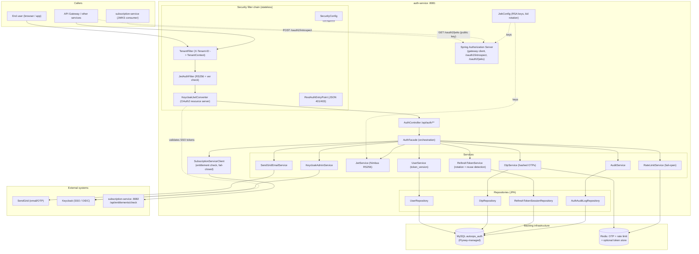
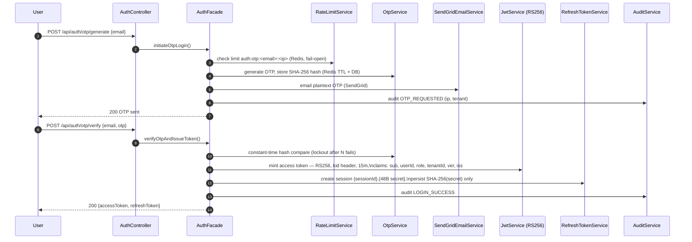
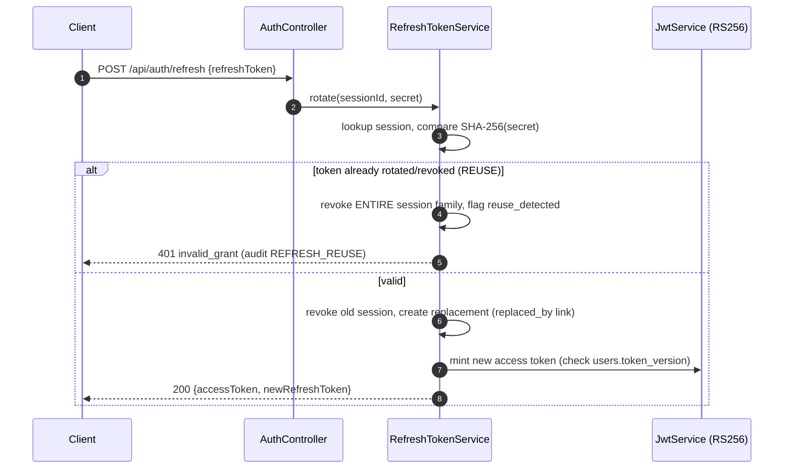

# AutoOps Auth Service — Architecture Blueprint Prompt (v2, Security-Hardened)

Use this prompt with an AI coding assistant (like opencode) to generate the complete AutoOps **auth-service**. This v2 keeps the original AutoOps flows (passwordless OTP login, Keycloak SSO, refresh rotation, gateway introspection, linked entitlement check) but upgrades the security architecture with the conventions and hardening adopted from the SkillRAT platform blueprint.

---

**Prompt:**

> You are building the AutoOps `auth-service`, the identity and token authority for the AutoOps platform. Follow the exact architecture, layers, conventions, and flows below. Do not deviate from the package structure or security decisions.

## Architecture Overview

- **Language:** Java 21
- **Framework:** Spring Boot 3.3.x, Spring Cloud 2023.0.x
- **Build:** Maven (multi-module with parent POM `com.intertec.autoops:autoops:1.0.0-SNAPSHOT`)
- **Security:** Spring Security + **Spring Authorization Server** + OAuth2 + **JWT RS256 (Nimbus `JwtEncoder`)** — *no shared HS256 secret anywhere*
- **Key distribution:** Public **JWKS endpoint** (`/oauth2/jwks`) — downstream services (subscription-service, gateway) validate tokens locally with the public key
- **Database:** MySQL `autoops_auth` + Spring Data JPA (Hibernate) + **Flyway** (`ddl-auto=validate`)
- **Cache / rate-limit / OTP store:** Redis (`StringRedisTemplate`)
- **Inter-service comm:** `RestClient` with **bounded connect/read timeouts** + `X-Tenant-ID` header propagation
- **SSO:** Keycloak (OIDC authorization-code flow)
- **Email:** SendGrid (OTP delivery)
- **Docs:** springdoc-openapi + Swagger UI; **Actuator** (secured)
- **Port:** `8081` · **Base package:** `com.intertec.autoops.auth`

## Security upgrades in v2 (vs. v1)

1. **RS256 replaces HS256.** Tokens are signed with an RSA private key held ONLY by auth-service. `JWT_SECRET` is deleted from the platform. subscription-service and the gateway validate via the JWKS endpoint (cacheable, `kid`-aware). Key rotation = publish new key with new `kid`, keep old key in JWKS until last token expires.
2. **Spring Authorization Server** provides the OAuth2 machinery: a registered `gateway` client, RFC 7662 introspection at `/oauth2/introspect`, and `OAuth2Authorization` persistence for revocation-aware introspection.
3. **Refresh tokens hardened:** format `{sessionId}.{48-byte-random-secret}` (Base64URL). Only the **SHA-256 hash** of the secret is stored. Rotation on every refresh with **reuse detection** — presenting an already-rotated token revokes the entire session family.
4. **OTPs stored hashed** (SHA-256) in both Redis and MySQL, never plaintext. Constant-time comparison. Lockout after N failed attempts.
5. **Token version claim (`ver`)** on the `users` row — `logout-all` increments it, instantly invalidating all outstanding access tokens at introspection/validation time.
6. **Configurable token store** — `autoops.auth.token-store: jdbc | redis` selects where `OAuth2Authorization` state lives.
7. **IP resolution chain** for rate limiting and audit: `X-Forwarded-For` → `X-Real-IP` → `request.getRemoteAddr()`.
8. **Audit logging** — `auth_audit_log` table records logins, failures, refreshes, revocations, onboard/offboard with IP + tenant.
9. Kept from v1 (they were already right): rate limiting **fail-open**, entitlement check **fail-closed** (with `ENTITLEMENT_FAIL_OPEN` escape hatch), Flyway migrations, bounded client timeouts, JSON 401/403 entry point, stateless filter chain.

## Package Structure (folders added in v2 marked ★)

```
auth-service/
├── pom.xml
├── Dockerfile
└── src/main/
    ├── java/com/intertec/autoops/auth/
    │   ├── AuthServiceApplication.java          // @SpringBootApplication
    │   ├── config/
    │   │   ├── AuthProperties.java              // @ConfigurationProperties("autoops.auth")
    │   │   ├── SecurityConfig.java              // stateless filter chain, route rules
    │   │   ├── AuthorizationServerConfig.java ★ // SAS: gateway client, introspection
    │   │   ├── JwkConfig.java ★                 // RSA key pair, JWKSource, kid rotation
    │   │   ├── TokenStoreConfig.java ★          // JDBC vs Redis OAuth2AuthorizationService
    │   │   ├── WebConfig.java ★                 // CORS, RestClient builder
    │   │   ├── RedisConfig.java
    │   │   ├── SendGridConfig.java
    │   │   ├── KeycloakConfig.java
    │   │   ├── SubscriptionClientConfig.java    // RestClient + connect/read timeouts
    │   │   └── OpenApiConfig.java
    │   ├── security/ ★                          // filters split out of config
    │   │   ├── TenantFilter.java                // X-Tenant-ID -> TenantContext (ThreadLocal)
    │   │   ├── JwtAuthFilter.java               // RS256 access-token validation + ver check
    │   │   ├── KeycloakJwtConverter.java        // OAuth2 resource server converter
    │   │   ├── RestAuthEntryPoint.java          // JSON 401/403
    │   │   └── IpResolver.java ★                // XFF -> X-Real-IP -> remoteAddr
    │   ├── domain/                              // JPA @Entity, plain POJOs, NO Lombok
    │   │   ├── User.java                        // + tokenVersion field
    │   │   ├── OtpEntry.java                    // otpHash, attempts, expiresAt
    │   │   ├── RefreshTokenSession.java         // tokenHash, replacedBy, reuseDetected
    │   │   └── AuthAuditLog.java ★
    │   ├── repo/                                // Spring Data JPA interfaces
    │   │   ├── UserRepository.java
    │   │   ├── OtpRepository.java
    │   │   ├── RefreshTokenSessionRepository.java
    │   │   └── AuthAuditLogRepository.java ★
    │   ├── service/                             // concrete classes (interface only if >1 impl)
    │   │   ├── OtpService.java
    │   │   ├── UserService.java
    │   │   ├── JwtService.java                  // RS256 issue via Nimbus JwtEncoder
    │   │   ├── RefreshTokenService.java         // rotation + reuse detection
    │   │   ├── RateLimitService.java            // Redis, FAIL-OPEN
    │   │   ├── SendGridEmailService.java
    │   │   ├── KeycloakAdminService.java
    │   │   ├── AuditService.java ★
    │   │   └── impl/ ★                          // only when an interface exists
    │   ├── client/ ★                            // REST clients for inter-service calls
    │   │   └── SubscriptionServiceClient.java   // entitlement check, FAIL-CLOSED
    │   ├── facade/ ★
    │   │   └── AuthFacade.java                  // orchestration (kept from v1 design)
    │   ├── exception/ ★
    │   │   ├── AuthException.java
    │   │   └── GlobalExceptionHandler.java      // @RestControllerAdvice, JSON errors
    │   └── web/
    │       ├── AuthController.java              // /api/auth/**
    │       ├── DevTokenController.java          // @Profile("dev") debug-only
    │       └── dto/ ★                           // Java records + validation annotations
    │           ├── OtpGenerateRequest.java      // record, @NotBlank @Email
    │           ├── OtpVerifyRequest.java
    │           ├── TokenResponse.java
    │           ├── RefreshRequest.java
    │           ├── IntrospectResponse.java
    │           ├── AuthorizeRequest.java / AuthorizeResponse.java
    │           └── OnboardRequest.java
    └── resources/
        ├── application.yml
        ├── application-dev.yml
        ├── application-prod.yml
        └── db/migration/
            ├── V1__init.sql                     // users, otp, sessions, audit
            └── V2__authorization_server.sql     // SAS tables (jdbc token store)
```

## Layer Responsibilities

| Layer | Package | What it does |
|-------|---------|--------------|
| Web/Controller | `web` | REST endpoints, `@Valid`, header extraction, delegate to facade |
| DTO | `web.dto` | Java records with `@NotBlank`/`@NotNull`/`@Email` |
| Facade | `facade` | Orchestrates services per use-case (OTP login, refresh, authorize) |
| Service | `service` | Business logic, `@Transactional`, rate limiting, token issuance |
| Client | `client` | `RestClient` calls to other services with `X-Tenant-ID` propagation |
| Repository | `repo` | Spring Data JPA interfaces extending `JpaRepository` |
| Domain | `domain` | JPA `@Entity`, explicit getters/setters (no Lombok) |
| Security | `security` | Filters, tenant context, IP resolution, JSON auth entry point |
| Config | `config` | `@Configuration`, `@ConfigurationProperties`, SAS, JWKS, beans |

## Conventions (adopted from SkillRAT)

1. **No Lombok** — explicit getters/setters/constructors
2. **Java records** for all request/response DTOs
3. **Constructor injection** only — no field `@Autowired`
4. **Services are concrete classes**; interfaces only when multiple implementations exist
5. **Multi-tenancy** via `X-Tenant-ID` header passed through all layers (`TenantContext` ThreadLocal, cleared in `finally`)
6. **Package naming:** `com.intertec.autoops.auth.<layer>`
7. **IP resolution:** `X-Forwarded-For` → `X-Real-IP` → `request.getRemoteAddr()`
8. **Config properties** kebab-case, grouped under `autoops.auth.*`
9. **`@Profile("dev")`** for debug-only controllers
10. **Flyway** owns schema; `spring.jpa.hibernate.ddl-auto=validate`
11. **Business validation failures** throw domain exceptions handled by `GlobalExceptionHandler` → consistent JSON error body
12. **Strict enums, no raw VARCHAR for closed value sets** — `role`, `status`, `delivery_status`, and audit `event_type` are MySQL `ENUM` columns; map with Java `enum` + `@Enumerated(EnumType.STRING)` and matching `columnDefinition`. Extending a value set = Flyway `ALTER TABLE … MODIFY` migration + new Java enum constant. (Exception: `oauth2_*` tables keep the framework-standard SAS schema.)

## Component / layer architecture



## Runtime flow — OTP login + token issuance (same flow as v1, hardened)



## Runtime flow — refresh rotation with reuse detection (new in v2)



## HTTP API

| Method | Path | Access | Purpose |
| --- | --- | --- | --- |
| POST | `/api/auth/otp/generate` | public | Generate + email an OTP (rate-limited) |
| POST | `/api/auth/otp/verify` | public | Verify OTP → access + refresh tokens |
| POST | `/api/auth/refresh` | public (refresh token) | Rotate token pair (reuse detection) |
| POST | `/api/auth/logout` | public (refresh token) | Revoke current session (by deviceId) |
| POST | `/api/auth/logout-all` | bearer | Revoke all sessions + **increment token_version** |
| POST | `/oauth2/introspect` | gateway client (basic auth) | RFC 7662 introspection via SAS |
| GET | `/oauth2/jwks` | public | JWKS — public keys for local validation |
| POST | `/api/auth/authorize` | public (gateway) | Validate token **and** verify subscription entitlement |
| GET | `/api/auth/sso/initiate` | public | Start Keycloak OIDC flow |
| GET | `/api/auth/sso/callback` | Keycloak | SSO login callback → issue AutoOps tokens |
| POST | `/api/auth/onboard` | ADMIN | Create a user (audited) |
| POST | `/api/auth/offboard/{userId}` | ADMIN | Disable user + kill sessions + bump token_version |
| GET | `/api/auth/me` | bearer | Current user profile |

## Token contract (validated by gateway + subscription-service via JWKS)

**RS256**, `kid` in header. **No shared secret exists.** Claims:

| Claim | Meaning |
| --- | --- |
| `sub` | user email |
| `userId` | numeric user id |
| `role` | `PROVIDER` \| `CLIENT` \| `ADMIN` |
| `tenantId` | tenant identifier |
| `tokenType` | `access` |
| `status` | user status |
| `ver` | user token version (bumped on logout-all / offboard) |
| `iss` | `autoops-auth-service` |
| `iat` / `exp` | issued / expiry (15 min) |

> Downstream validation: fetch + cache `/oauth2/jwks`, verify signature by `kid`, check `iss`, `exp`, `tokenType=access`. For revocation-sensitive routes, call `/oauth2/introspect` (checks `ver` + `OAuth2Authorization` state).

## Key Implementation Details

- **JWT:** `JwtEncoder` (Nimbus) with `JWKSource` from `JwkConfig`. RSA-2048 minimum. Dev profile may auto-generate a key pair; prod loads from `JWT_KEYSTORE_PATH` (PKCS#12) or PEM env vars.
- **Key rotation:** support multiple keys in JWKS; sign with newest `kid`; retire old keys after max token lifetime.
- **Refresh tokens:** `{sessionId}.{48-byte-random-secret}` (SecureRandom, Base64URL). Store only SHA-256 hash. Rotation links `replaced_by_session`; reuse revokes the family.
- **OTP:** 6 digits, SecureRandom, TTL 5 min, SHA-256 hashed at rest, max 5 attempts then lockout, constant-time compare (`MessageDigest.isEqual`).
- **OTP delivery via SendGrid v3 API** (`sendgrid-java`, `POST /v3/mail/send`):
  - `SendGridEmailService` sends a **dynamic transactional template** (`SENDGRID_OTP_TEMPLATE_ID`) with the OTP as template data — no HTML built in code.
  - Capture the `X-Message-Id` response header into `otp_entries.sendgrid_message_id`; set `delivery_status = SENT` on 202, `FAILED` otherwise (audit `OTP_DELIVERY_FAILED`).
  - Optional **SendGrid Event Webhook** (`POST /api/auth/webhooks/sendgrid`, signature-verified via `SENDGRID_WEBHOOK_PUBLIC_KEY`) updates `delivery_status` to `DELIVERED` / `BOUNCED` by message id.
  - Send the email **after** the DB transaction commits (`@TransactionalEventListener(AFTER_COMMIT)`) so no OTP row exists without a send attempt.
  - Never log or store the plaintext OTP; SendGrid call is wrapped with a 3s timeout and one retry, **fail-closed** (user sees "try again") on failure.
- **Authorization Server:** register `gateway` client (client-credentials for introspection auth). Persist issued access tokens as `OAuth2Authorization` so introspection reflects revocation.
- **Token store:** `autoops.auth.token-store=jdbc|redis` — `TokenStoreConfig` wires `JdbcOAuth2AuthorizationService` or a Redis-backed implementation.
- **Rate limiting:** Redis keys `auth:otp:<email>:<ip>` and `auth:verify:<email>:<ip>`, sliding window, **fail-open** on Redis outage.
- **Entitlement check:** `SubscriptionServiceClient` forwards caller's Bearer to `POST /api/entitlements/check`; bounded timeouts (2s connect / 3s read); **fail-closed** unless `ENTITLEMENT_FAIL_OPEN=true`.
- **Actuator:** expose `health,info,prometheus` only; secure everything else.
- **Error handling:** domain exceptions → `GlobalExceptionHandler` → `{"error": ..., "message": ...}` JSON; never leak stack traces.
- **Annotations:** services `@Service`, repos extend `JpaRepository`, controllers `@RestController`, transactions `@Transactional` at service layer.

## Dependencies (pom.xml)

```xml
<parent>
    <groupId>com.intertec.autoops</groupId>
    <artifactId>autoops</artifactId>
    <version>1.0.0-SNAPSHOT</version>
</parent>
<artifactId>auth-service</artifactId>
<dependencies>
    spring-boot-starter-web
    spring-boot-starter-security
    spring-boot-starter-oauth2-authorization-server
    spring-boot-starter-oauth2-resource-server   <!-- Keycloak SSO validation -->
    spring-boot-starter-data-jpa
    spring-boot-starter-data-redis
    spring-boot-starter-validation
    spring-boot-starter-actuator
    flyway-core + flyway-mysql
    springdoc-openapi-starter-webmvc-ui (2.5.x)
    sendgrid-java
    mysql-connector-j (runtime)
    h2 (test runtime — hermetic test profile)
    common-orm (internal shared library: global error handler, base entities)
</dependencies>
```

## Key configuration

| Env var | Default | Purpose |
| --- | --- | --- |
| `SERVER_PORT` | `8081` | HTTP port |
| `JWT_KEYSTORE_PATH` / `JWT_KEYSTORE_PASSWORD` | dev: auto-generated | RSA signing keys (PKCS#12) |
| `JWT_ISSUER` | `autoops-auth-service` | Token issuer |
| `ACCESS_TOKEN_TTL` | `15m` | Access token lifetime |
| `REFRESH_TOKEN_TTL` | `30d` | Refresh session lifetime |
| `TOKEN_STORE` | `jdbc` | `jdbc` or `redis` OAuth2Authorization store |
| `DB_HOST` / `DB_PORT` / `DB_NAME` | `localhost` / `3306` / `autoops_auth` | MySQL |
| `REDIS_HOST` / `REDIS_PORT` | `localhost` / `6379` | Redis |
| `SUBSCRIPTION_SERVICE_URL` | `http://localhost:8082` | Linked subscription-service |
| `ENTITLEMENT_FAIL_OPEN` | `false` | Entitlement fallback behaviour |
| `KEYCLOAK_ISSUER_URI` | `http://localhost:8180/realms/autoops` | SSO |
| `SENDGRID_API_KEY` | placeholder | Email provider |
| `SENDGRID_OTP_TEMPLATE_ID` | placeholder | Dynamic template for OTP mail |
| `SENDGRID_FROM_EMAIL` | `no-reply@autoops.io` | Verified sender identity |
| `SENDGRID_WEBHOOK_PUBLIC_KEY` | — (webhook disabled) | Verify Event Webhook signatures |
| `GATEWAY_CLIENT_ID` / `GATEWAY_CLIENT_SECRET` | dev values | Introspection client credentials |

> ⚠️ `JWT_SECRET` is intentionally **removed**. If any service still references it, that reference must be replaced with JWKS-based validation.

## Build & run

```bash
mvn verify                 # build + tests (hermetic H2 profile)
docker compose up -d       # MySQL + Redis (+ Keycloak for SSO testing)
mvn spring-boot:run        # start on :8081
# Swagger UI: http://localhost:8081/swagger-ui.html
# JWKS:       http://localhost:8081/oauth2/jwks
```

## Database schema (Flyway)

See `V1__init.sql` and `V2__authorization_server.sql` (full SQL in the companion schema file).

- `users` — identity, role, status, tenant, **token_version**, optional keycloak_subject
- `otp_entries` — hashed OTP challenges, attempt counters, expiry (also mirrored in Redis)
- `refresh_token_sessions` — hashed refresh secrets, rotation chain (`replaced_by_session`), reuse flag, device/IP metadata
- `auth_audit_log` — security event trail
- `oauth2_registered_client` / `oauth2_authorization` — Spring Authorization Server tables (JDBC token store)

Now generate the complete auth service with all the above files, following every convention exactly. Create the folder structure, pom.xml, Dockerfile, application YAMLs, all Java classes, and the Flyway migrations.
