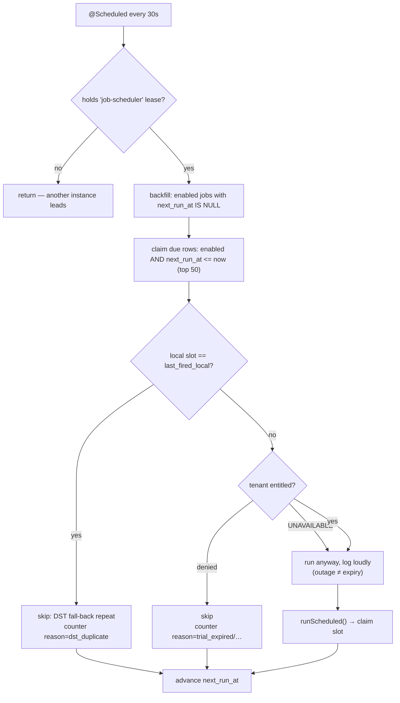

# Job scheduling & timezones — reference

Status: **built and deployed**. Shipped in migrations `V19` + `V20`.

Audience: anyone touching job scheduling, debugging a run that fired at the
wrong time, or answering a customer asking "what happens on the DST day?".

Scope: **jobs only**. Workflows have no `schedule` field and are not
schedulable. The only other `@Scheduled` bean in the platform is
auth-service's `PurgeService`, which is unrelated to this.

---

## 1. The mental model

Two things are stored, and they mean different things:

| Stored | Type | Meaning |
|---|---|---|
| `jobs.schedule` | cron string | A **local-time rule** — "2 AM" |
| `jobs.schedule_timezone` | IANA zone ID | **Whose** 2 AM — `America/Chicago` |
| `jobs.next_run_at` | absolute instant (UTC) | The **moment** that resolves to, right now |
| `jobs.last_fired_local` | local wall clock | The slot a run was last queued for (DST only) |

The rule is local, the resolved moment is absolute. `0 2 * * *` in
`America/Chicago` means 2 AM Chicago **all year round**, so the UTC instant it
lands on moves by an hour across a DST transition. That movement is the
feature, not a bug.

Everything downstream — the due-row query, run records, the UI clock — works
in absolute instants. Only the *interpretation* of the cron is zone-aware.

> **The one rule that matters:** never store an offset. Store a zone.
> `-06:00` is a fact about one moment; `America/Chicago` is a rule about all
> of them.

---

## 2. Where the code lives

Scheduling is entirely in **core-service**. `job-service` is a pure executor
(AWS Lambda, Azure Functions, k8s, SSH, Terraform, REST, script…) and contains
no cron or timezone code at all.

| Concern | File |
|---|---|
| Cron parsing, zone validation, next-fire | `service/CronSupport.java` |
| Poll loop, entitlement gate, DST dedupe | `service/JobScheduler.java` |
| Leader election across instances | `service/SchedulerLeaseService.java` |
| Persisting schedule + zone | `service/JobService.java` |
| Entity | `domain/Job.java` |
| Due-row queries | `repo/JobRepository.java` |
| HTTP surface | `web/JobController.java`, `web/dto/JobRequest.java`, `web/dto/JobResponse.java` |
| Schema | `db/migration/V19__job_schedule_timezone.sql`, `V20__job_last_fired_local.sql` |
| Zone picker, dual-clock display | `frontend-web/src/lib/timezones.js`, `pages/app/Schedule.jsx`, `lib/api.js` |

---

## 3. Schema

```sql
-- V2, V3 (pre-existing)
schedule          VARCHAR(64)  NULL,          -- cron, 5- or 6-field
next_run_at       TIMESTAMP(6) NULL,          -- absolute instant
KEY idx_jobs_due (enabled, next_run_at)

-- V19
schedule_timezone VARCHAR(64)  NOT NULL DEFAULT 'UTC'  AFTER schedule,

-- V20
last_fired_local  DATETIME(6)  NULL           AFTER schedule_timezone,
```

Two deliberate choices:

- **`DEFAULT 'UTC'` on V19.** Every pre-existing job kept firing at exactly the
  instant it always had. A migration must never move somebody's schedule.
- **`last_fired_local` is `DATETIME`, not `TIMESTAMP`.** It is a wall-clock
  reading in the job's own zone, and MySQL must not timezone-convert it. It is
  meaningless without `schedule_timezone`, and is cleared whenever that
  changes.

---

## 4. Cron format

`CronSupport.parse()` accepts both, normalising 5-field to 6 by prepending
seconds:

| Form | Example | Meaning |
|---|---|---|
| 5-field unix (what the UI emits) | `0 2 * * *` | 02:00 local, daily |
| 6-field Spring | `0 30 2 * * *` | 02:30:00 local, daily |

Unparseable input → `400 invalid_schedule`.

---

## 5. Timezone validation

`CronSupport.zone()` accepts **only**:

- a full `Region/City` IANA ID — `America/Chicago`, `Asia/Kolkata`
- the bare string `UTC`

Everything else is `400 invalid_timezone`. The rule is literally "contains a
`/`, or is `UTC`", then `ZoneId.of()`.

### Why abbreviations are refused

This is the part that costs you a production incident if you get it wrong.

| Input | Verdict | Reason |
|---|---|---|
| `America/Chicago` | accepted | carries DST rules |
| `UTC` | accepted | the default; no DST to carry |
| `CST` | rejected | ambiguous: America/Chicago vs America/Mexico_City |
| `MST` | rejected | ambiguous: Denver **shifts**, Phoenix **never does** |
| `IST` | rejected | Indian / Irish / Israel Standard Time |
| `-06:00` | rejected | an offset is one moment's truth, not a rule |
| `America/Atlantis` | rejected | not a known zone |

`ZoneId.of("MST")` already throws `ZoneRulesException`, so our guard is not
strictly required today. It exists because of the *next* change someone makes.
`ZoneId.SHORT_IDS` — the obvious "let's be helpful and accept CST" shortcut —
resolves like this (verified, pinned in `CronSupportTest`):

```
ZoneId.SHORT_IDS["MST"] = "-07:00"           <- a FIXED offset. The Phoenix answer.
ZoneId.SHORT_IDS["CST"] = "America/Chicago"  <- a guess against Mexico_City.
ZoneId.SHORT_IDS["IST"] = "Asia/Kolkata"     <- a guess against Ireland/Israel.
```

A user in Denver who typed `MST` would silently get a zone that never observes
DST, and would be an hour off for eight months a year. The guard keeps that
door shut.

### Denver vs Phoenix, concretely

Verified live against the running stack on 2026-07-31, all with `0 2 * * *`:

| Zone | Next fire (UTC) | Local offset |
|---|---|---|
| `Asia/Kolkata` | `2026-07-31T20:30:00Z` | +05:30 |
| `UTC` | `2026-08-01T02:00:00Z` | ±00:00 |
| `America/Chicago` | `2026-08-01T07:00:00Z` | −05:00 (CDT) |
| `America/Denver` | `2026-08-01T08:00:00Z` | −06:00 (MDT) |
| `America/Phoenix` | `2026-08-01T09:00:00Z` | −07:00 (MST, no DST) |

Denver and Phoenix are one hour apart in August and identical in January.
That difference is exactly what the string `MST` cannot express.

---

## 6. DST behaviour

Both transitions are pinned by tests in `CronSupportTest` and
`JobSchedulerTest`. Neither is a preference — they are the documented,
verified semantics.

### Spring forward — the run is skipped

`America/Chicago`, 2026-03-08: the clock jumps `02:00 → 03:00`. Local time
02:30 **does not exist** that day.

```
America/Chicago · 2026-03-08 · cron  30 2 * * *

  local   01:30        ╳╳╳╳╳╳         03:30        04:30
                       ╳ 02:30 ╳
  UTC     07:30Z       ╳  ──   ╳      08:30Z       09:30Z
  offset  −06:00       ╳ gone  ╳      −05:00       −05:00
                       └───────┘
                    does not exist
```
```
cron  30 2 * * *
last  2026-03-07T02:30 local  = 2026-03-07T08:30Z
next  2026-03-09T02:30 local  = 2026-03-09T07:30Z   <- 03-08 skipped entirely
```

A daily 02:30 job loses exactly one run per year. This needs no code: the
local time is unrepresentable, so the cron moves to the next day on its own.

If a job must not miss that run, schedule it outside 02:00–03:00 local. A
02:30 window is the one hour of the year that doesn't exist.

### Fall back — the run is de-duplicated

`America/Chicago`, 2026-11-01: the clock repeats `01:00–02:00`. Local time
01:30 happens **twice**, an hour apart:

```
America/Chicago · 2026-11-01 · cron  30 1 * * *

  local   00:30      ┌─ 01:30 ─┐   ┌─ 01:30 ─┐      02:30
  UTC     05:30Z     │  06:30Z │   │  07:30Z │      08:30Z
  offset  −05:00     │ −05:00  │   │ −06:00  │      −06:00
                     │  CDT    │   │  CST    │
                     └─────────┘   └─────────┘
                        FIRES       SUPPRESSED
                     claims slot   same wall clock
```
```
01:30 CDT (−05:00) = 2026-11-01T06:30Z    <- fires, claims the slot
01:30 CST (−06:00) = 2026-11-01T07:30Z    <- same wall clock -> SUPPRESSED
```

Both are legitimately distinct instants and the cron resolves to both, so
without intervention a 01:30 job runs twice. `JobScheduler` collapses them:

```java
LocalDateTime slot = job.getNextRunAt()
        .atZone(CronSupport.zone(job.getScheduleTimezone()))
        .toLocalDateTime();

if (slot.equals(job.getLastFiredLocal())) {  // skip, but still advance
```

Normal slots never collide — consecutive fires always differ in local date or
local time — so this only ever fires on the fall-back hour.

#### Three rules the dedupe follows

| Situation | Slot claimed? | Why |
|---|---|---|
| Run queued successfully | **yes** | that's a real fire |
| Tenant's subscription denied the run | **no** | nothing ran, so a later run isn't a *double*. If entitlement recovers between the two instants, the customer still gets their run. |
| `runScheduled` threw | **no** | same reasoning; the slot still advances so a broken queue can't spin the poller |
| Job's timezone changed | marker **cleared** | the stored wall clock refers to the old zone's clock |

---

## 7. The poll loop



Properties worth knowing:

- **Single leader.** Only the instance holding the `job-scheduler` DB lease
  polls. `LEASE_TTL` is 90s, so a crashed leader is replaced within that.
- **Always advances.** Every path — fired, denied, deduped, broken cron —
  advances `next_run_at`. A job can never spin the poller.
- **One entitlement decision per tenant per poll**, not per job. A tenant with
  20 due jobs is checked once.
- **Outage ≠ expiry.** An unreachable subscription-service does *not* stop
  scheduled runs. The gate exists to stop expired tenants, not to make every
  tenant's cron fragile. (User-facing mutations fail closed; this does not.)
- **Batch size is 50** per poll, per query.

### Caveat: no catch-up after downtime

`advance()` computes the next fire from **`Instant.now()`**, not from the slot
that just fired. If the scheduler is down for three days, a daily job fires
**once** on recovery and then resumes normally — it does not backfill the
three missed runs.

This is pre-existing behaviour, unchanged by the timezone work, and is
asserted in `JobSchedulerTest`. If catch-up is ever wanted, that's a separate
design question from DST.

---

## 8. API

### Fields

`JobRequest` (POST `/api/projects/{projectId}/jobs`, PUT `/api/jobs/{id}`):

| Field | Constraint | Notes |
|---|---|---|
| `name` | `@NotBlank`, ≤128 | required on PUT too — merge from the current job |
| `schedule` | ≤64 | cron; `""` clears the schedule |
| `scheduleTimezone` | ≤64 | IANA zone ID |
| `group`, `description`, `definition`, `requiresApproval` | — | unrelated to scheduling |

`JobResponse` returns `schedule`, `scheduleTimezone`, and `nextRunAt`
(absolute, ISO-8601 UTC) alongside the rest of the job.

### Create/update semantics

| Sent | Effect |
|---|---|
| `scheduleTimezone` omitted **on create** | job gets `UTC` |
| `scheduleTimezone` omitted **on update** | job's existing zone is **left alone** — editing only the cron never silently resets a zone to UTC |
| `scheduleTimezone` changed | `next_run_at` recomputed, `last_fired_local` cleared |
| `schedule` omitted, `scheduleTimezone` sent | cron kept, `next_run_at` recomputed in the new zone |
| `schedule: ""` | schedule and `next_run_at` cleared; the job survives and stays manually runnable |

### Examples

Create, 2 AM Chicago:

```bash
curl -X POST http://localhost:8080/api/projects/28/jobs \
  -H "Authorization: Bearer $TOKEN" -H "Content-Type: application/json" \
  -d '{"name":"Nightly Backup","definition":"{\"steps\":[]}",
       "schedule":"0 2 * * *","scheduleTimezone":"America/Chicago"}'
```
```json
{ "id": 25, "schedule": "0 2 * * *",
  "scheduleTimezone": "America/Chicago", "nextRunAt": "2026-08-01T07:00:00Z" }
```

Move it to IST without touching the cron:

```bash
curl -X PUT http://localhost:8080/api/jobs/25 \
  -H "Authorization: Bearer $TOKEN" -H "Content-Type: application/json" \
  -d '{"name":"Nightly Backup","scheduleTimezone":"Asia/Kolkata"}'
```
```json
{ "schedule": "0 2 * * *",
  "scheduleTimezone": "Asia/Kolkata", "nextRunAt": "2026-07-31T20:30:00Z" }
```

### Errors

| Code | HTTP | Trigger |
|---|---|---|
| `invalid_schedule` | 400 | cron won't parse |
| `invalid_timezone` | 400 | abbreviation, offset, or unknown zone |
| `job_not_found` | 404 | wrong id or wrong tenant |

```json
{ "error": "invalid_timezone",
  "message": "Use a full IANA zone ID like 'America/Chicago' or 'UTC', not 'CST' — abbreviations and fixed offsets carry no DST rules" }
```

---

## 9. Frontend

`frontend-web/src/lib/timezones.js`:

| Export | Purpose |
|---|---|
| `browserTimezone()` | viewer's own zone via `Intl.DateTimeFormat().resolvedOptions().timeZone`; falls back to `UTC` |
| `timezoneOptions()` | `Intl.supportedValuesOf("timeZone")`, filtered to `Region/City`, `UTC` first; static fallback list for older Safari |
| `offsetLabel(zone)` | current offset, e.g. `GMT-5` |
| `fmtInZone(instant, zone)` | renders an absolute instant as wall clock in a zone |

On the Schedule page:

- The zone picker defaults to the **viewer's own zone** on create — right far
  more often than UTC — but stays editable, because an admin in one zone
  routinely schedules for a customer in another.
- Next run is shown **twice** when the job's zone differs from the viewer's:
  the job's local time, and "…your time" underneath. This is what stops
  "wait, when does this actually fire?" from being a recurring question.
- The `tz` column shows the zone plus its current offset.

`api.js` omits `scheduleTimezone` from the PUT body when the caller didn't
supply one, which is what preserves the "editing the cron doesn't reset the
zone" guarantee end-to-end.

---

## 10. Configuration & observability

| Setting | Env var | Default |
|---|---|---|
| `autoops.core.scheduler.enabled` | `SCHEDULER_ENABLED` | `true` |
| `autoops.core.scheduler.poll-interval` | `SCHEDULER_POLL_INTERVAL` | `30s` |
| `SchedulerLeaseService.LEASE_TTL` | — | 90s (constant) |

Metric — one counter, tagged by reason:

```
core_scheduled_runs_skipped_total{reason="dst_duplicate"}   # fall-back suppression
core_scheduled_runs_skipped_total{reason="trial_expired"}   # entitlement
core_scheduled_runs_skipped_total{reason="..."}             # other denials
```

`dst_duplicate` should be **zero all year** and tick up a handful of times on
each fall-back date. A non-zero count on any other day means the dedupe is
matching slots it shouldn't — investigate rather than ignore.

Log lines:

```
INFO  Skipping job 30 — local slot 2026-11-01T01:30 (America/Chicago) already ran; DST fall-back repeat
INFO  Skipping scheduled job 12 — tenant acme subscription denies runs (trial_expired)
WARN  Entitlements unreachable — scheduled job 12 (tenant acme) runs unchecked
WARN  Job 12 has an invalid stored schedule '...' (America/Chicago) — clearing it
```

---

## 11. Tests

| File | Count | Covers |
|---|---|---|
| `CronSupportTest` | 14 | zone resolution, rejection of abbreviations/offsets, both DST transitions, `SHORT_IDS` rationale, cron parsing |
| `JobSchedulerTest` | 10 | lease, entitlement gate, and 6 dedupe cases: suppression, next-day still fires, denied tenant doesn't claim, failed queue doesn't claim, fixture sanity |

Whole core-service suite: **156 tests**, all green, with V19 + V20 applied
against real MySQL.

Two assertions in these tests were wrong on first write and were corrected
against observed behaviour rather than the other way round — the spring-forward
run is skipped (not shifted), and the fall-back hour fires twice (not once).
Trust the tests over intuition here.

---

## 12. Known gaps

Ranked by how likely they are to bite.

1. **`Settings.jsx:325`** has a tenant "Timezone" dropdown offering exactly the
   abbreviations the backend now rejects (`EST/CST/MST/PST/IST`). It is inert —
   no handler, no backend endpoint — but it directly contradicts the job
   picker. Wire it to IANA IDs or delete it.
2. **`frontend-web/` is gitignored** (`.gitignore:2`). The zone picker,
   `timezones.js`, and the `api.js` changes are **not** under version control
   in this repo. Backend changes are.
3. **No per-tenant default zone.** Every job defaults to the viewer's browser
   zone at create time. A tenant-level default would only pre-fill the picker —
   storage stays per-job, so this is purely additive whenever you want it.
4. **No catch-up after downtime** — see §7.
5. **Workflows aren't schedulable at all.** If that changes, the same
   `schedule` + `schedule_timezone` + `last_fired_local` triple applies.
